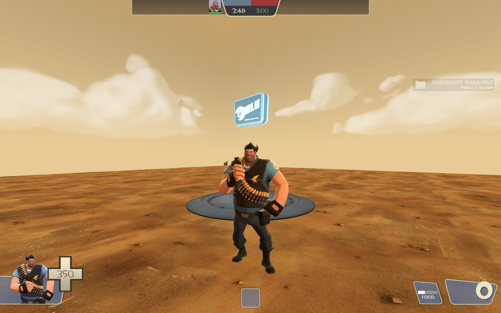
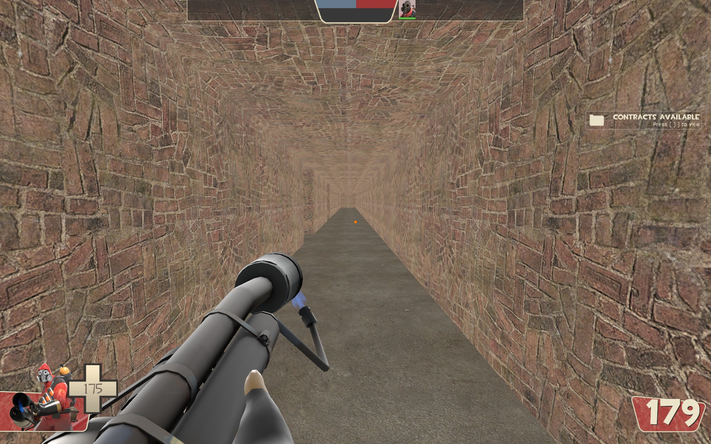
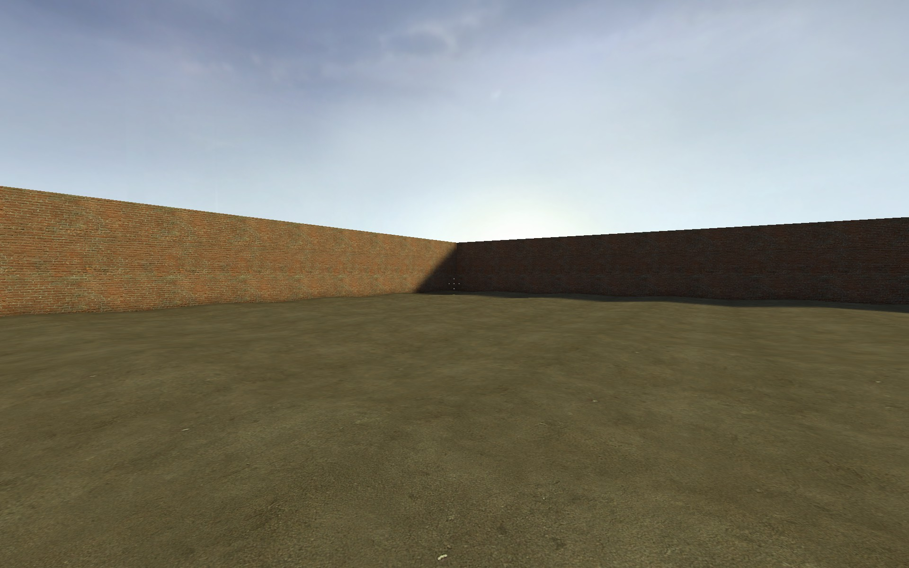
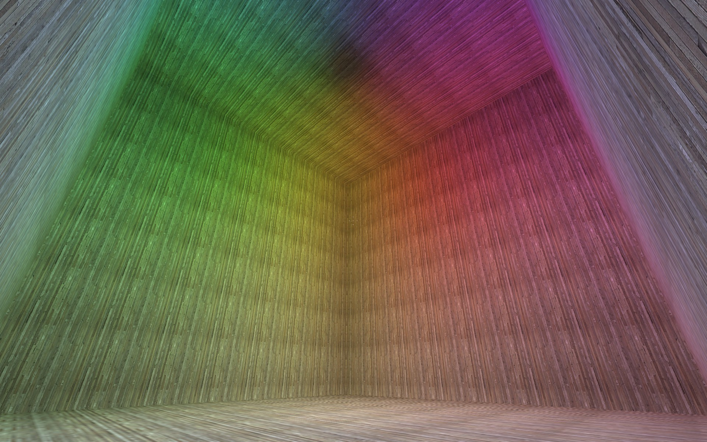
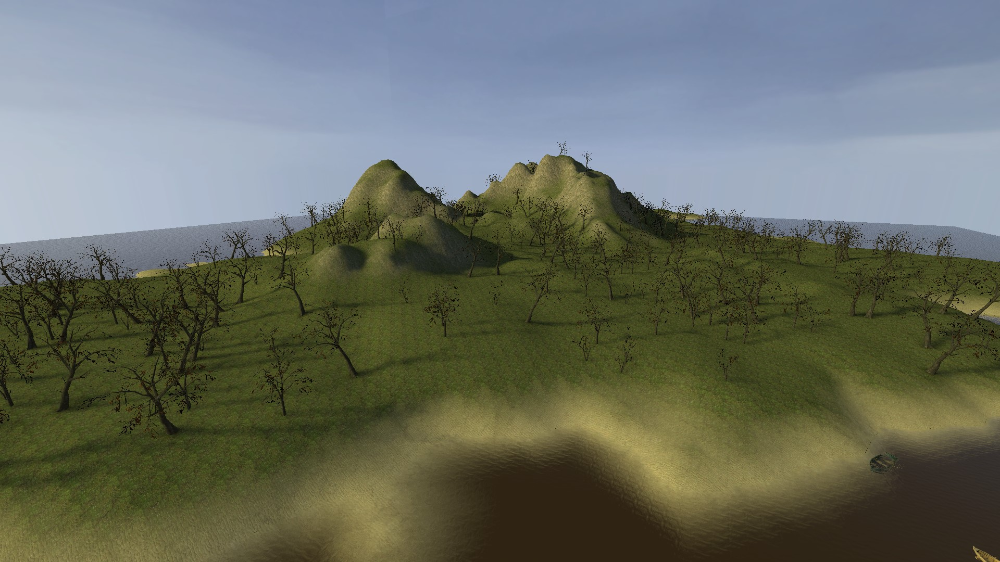
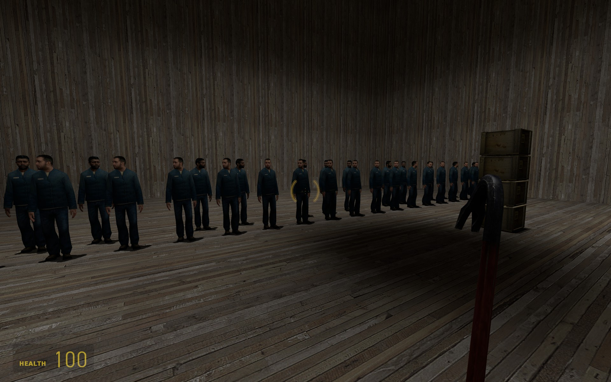

# Example Map Generators

The vmflib git repository comes with a number of small example scripts to help 
you understand how to use its features.  This selection continues to grow, but 
we will use this page to try and document the examples so that you have an idea 
of what they produce.

## koth_vmflib_example

Game: Team Fortress 2

This script demonstrates vmflib2 by generating a basic "king of the hill" style
map.  "King of the hill" is a game mode in Team Fortress 2 where each team tries
to maintain control of a central "control point" for some total defined amount
of time (before the other team does).

This example highlights the use of TF2 game mechanics (in this case the use of
a control point and a goal timer). A simple implementation of team 
spawn/resupply areas is also planned.

## maze

Game: Team Fortress 2

This script demonstrates vmflib2 by generating a map that places the player
inside a maze. The maze itself is dynamically generated upon execution of 
this script, using 
[an example maze generation function from Wikipedia](http://en.wikipedia.org/wiki/Maze_generation_algorithm#Python_code_example).

This example also shows how team-specific spawn points can be defined.

## outdoor

Game: Half-Life 2

This script demonstrates generating a map with a 2D skybox and
some terrain (a displacement map).

The sky is achieved by painting some upper walls with a special material called 
"tools/toolsskybox2d".  When the player looks at these surfaces, they will see 
whatever skybox is listed in the world's "skyname" property.

The bumpy/uneven terrain is a displacement map, which is created by generating a 
2D list of normal vectors and a 2D list of displacements.  These are used to 
initialize a DispInfo object, which is added to the Side one wishes to make into 
a displacement map.  In this example, we just use (0 0 1) for all of the normal 
vectors (all of the displacements will be straight up along the Z axis) and a 
simple math formula based on the row and column for the distances.

## woodbox_block

Game: Half-Life 2

This script demonstrates generating a map consisting of a large
empty room.

This example shows off the tools.Block class, which allows for the easy
creation of 3D block brushes

## woodbox

Game: Half-Life 2

This script produces the same result as woodbox, but without the tools.Block 
class.  In other words, all the sides and vertices are specified in the script. 
This is the nitty-gritty way of specifying world geometry.

## heightmap

Game: Half-Life 2

This script demonstrates generating a map consisting of a large
island covered with trees.

This example shows off the tools.DisplacementMap class, which allows for the easy
creation of multi-displacement surfaces. The height data is read from a heightmap image, and the alpha data (whether
any particular spot is sand or grass) is made based off of the height data.

This example requires the PIL package for reading the heightmap image.

## keyboard

Game: Half-Life 2

This script demonstrates spawning NPCs, items, and weapons. The NPCs have connections
that make each one play a sound when used. There also are several crates full of manhacks
that will attack the NPCs, also triggering the sound.

